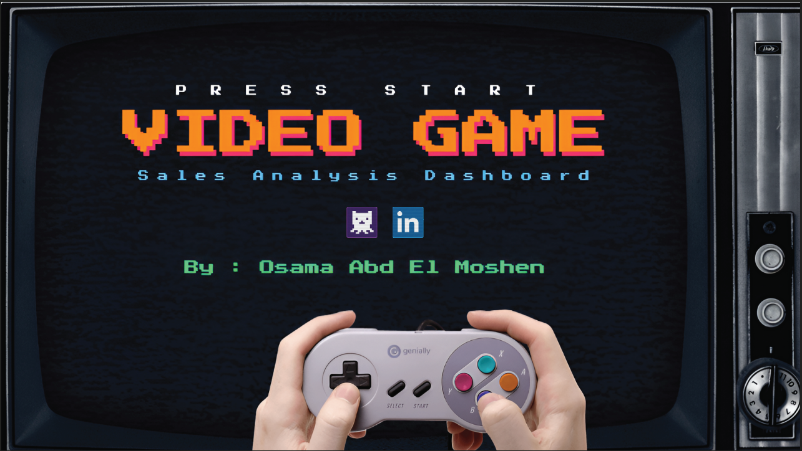
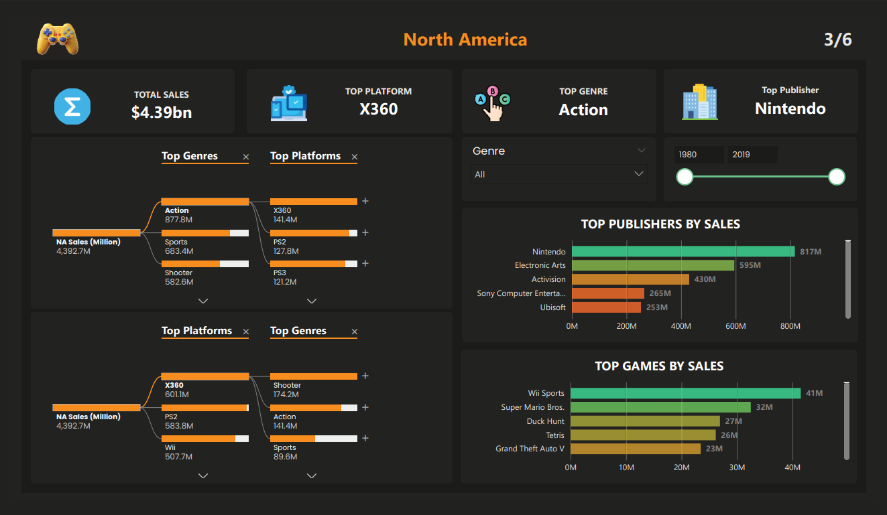
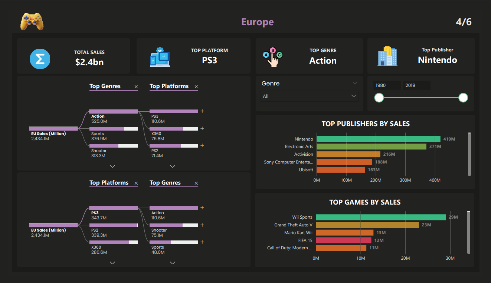
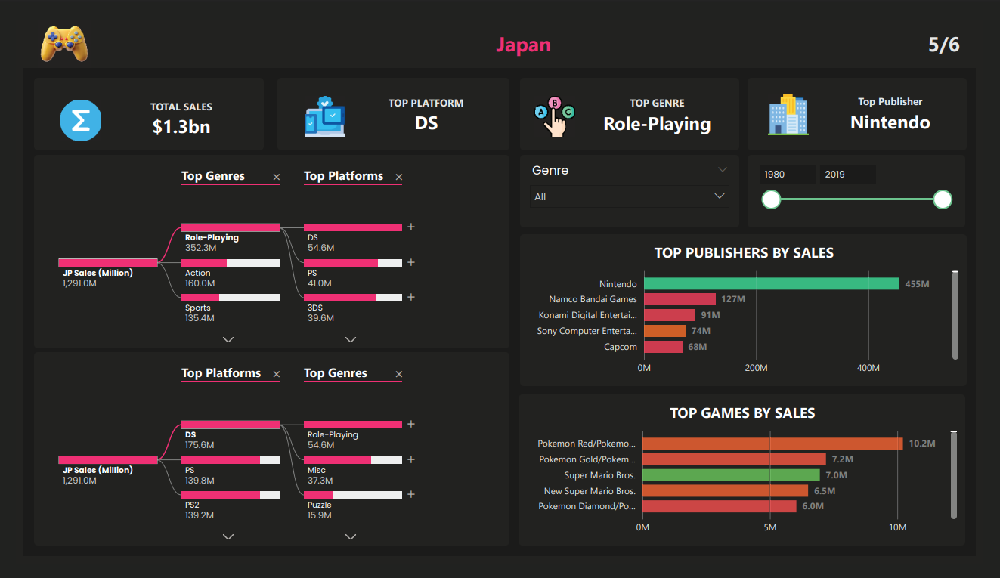

# 🎮 Video Game Sales Analysis Dashboard (Power BI)
An interactive Power BI dashboard analyzing global video game sales across regions, platforms, genres, publishers, and time.

## 📌 Project Overview
This project explores historical video game sales data to uncover key trends, regional preferences, and market drivers.  
The dashboard is designed with a strong focus on **data storytelling**, **interactivity**, and **business insights**.

## 📊 Dataset
- Source: Kaggle – Video Game Sales Dataset
- Time Range: 1980 – 2020
- Records: 16,000+ video games
- Key Fields: Platform, Genre, Publisher, Global & Regional Sales

## 🎯 Business Questions Answered
- Which regions drive the highest video game sales?
- How do genre preferences differ across regions?
- What platforms dominate each market?
- Which publishers and games generate the most revenue?
- How do trends vary over time?

## 🧠 Key Insights
- North America contributes nearly **50% of global video game sales**
- **Action** is the dominant genre globally, while **Japan strongly prefers RPG**
- Platform dominance varies significantly by region
- Nintendo consistently ranks as the top publisher worldwide
- Sales trends show strong generational shifts across consoles

## 📌 Features
- Multi-page dashboard (Overview, Global, Regional Analysis)
- Interactive filtering between publishers, games, and visuals
- Consistent regional color mapping
- Insight boxes summarizing key findings per page

## 📈 Dashboard Structure

| Page | ScreenShot |
|-----|---------------|
| 1 |
| 2 | 
| 3 | 
| 4 | 
| 5 | 

## 📊 Live Power BI Dashboard

👉 Click  [here](https://app.powerbi.com/view?r=eyJrIjoiZTg0NmNiOTktZWQ0Zi00MGNkLWJlNTktZjM4ZTg5NmQ2OWE5IiwidCI6ImU0MGU0YTI1LTY2MzgtNGE3MS05NTViLTgyZWI5MDYwMjBiMSJ9)  to view the interactive dashboard

